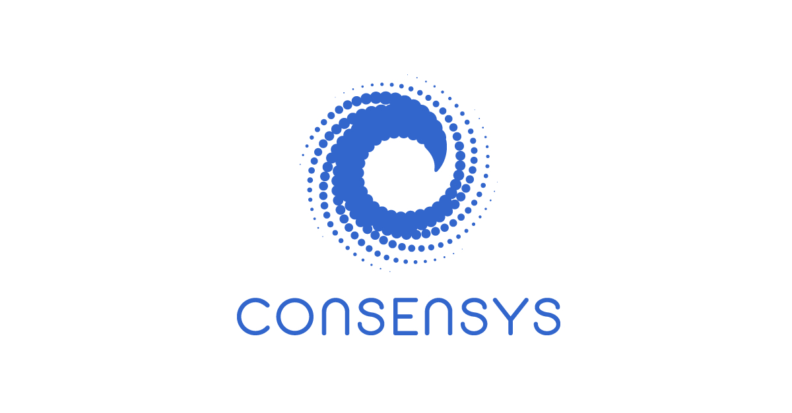
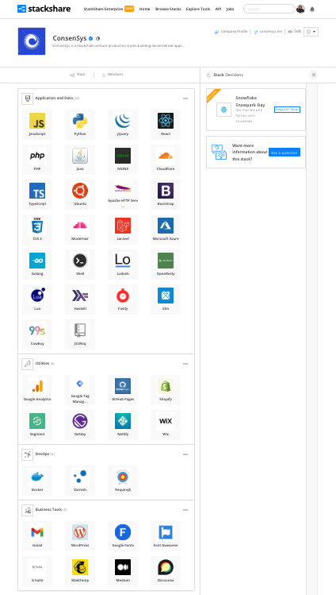

<h1 align="center">

  
  
</h1>

## Overview and Origin 

* [ConsenSys](https://www.consensys.net)
* Incorporated in 2014
* Joseph Lubin, Founder
* [Ethereum](https://ethereum.org) co-founder Joseph Lubin created ConsenSys as a development studio to create decentralized applications (dApps) that operate on the Ethereum blockchain
* Received [Series D Funding](https://www.crunchbase.com/funding_round/consensus-systems-series-d--527fba17) in March 2022, raising $450 million, bringing the total seed money to $725 million.

## Business Activities: 

* What specific financial problem is the company or project trying to solve?
  * ConsenSys has founded many applications in the [DeFi](https://academy.moralis.io/blog/why-the-defi-space-could-see-huge-growth-over-the-coming-years?utm_source=blog&utm_medium=post&utm_campaign=What%2520is%2520ConsenSys%253F%2520-%2520The%2520Ultimate%2520Guide) arena, to include Metamask, Infura, Truffle Suite, Codedefi, and Diligence. They build Ethereum software to enable developers and organizations to build applications on the decentralized web (web3).
   

* Who is the company's intended customer? Is there any information about the market size of this set of customers?
  * ConsenSys' customers are businesses and companies that need consulting with private blockchains.  ConsenSys is involved with blockchain compliance, auditing, research and analysis. ConsenSys also provides many tools in the web3 arena.
  
* What solution does this company offer that their competitors do not or cannot offer? (What is the unfair advantage they utilize?)
  * One tool, Metamask, is a web3 crypto wallet, where customers have full control of their private keys, as opposed to Coinbase and Binance.  This means that no third party vendors can touch Metamask users' funds
    
* Which technologies are they currently using, and how are they implementing them? 
  

    
  

   

## Landscape 

* What domain of the financial industry is the company in?
  * Blockchain and Cryptocurrencies
    
* What have been the major trends and innovations of this domain over the last 5-10 years?
  * Cryptocurrency has been increasing in the mainstream, for example, Bitcoin is the official currency of El Salvador, Hospitals are putting medical records on the blockchain, programmable smart contracts on the blockchain with Ethereum, supply chain management on the blockchain, and tokenisation. 
    
* What are the other major companies in this domain?
  * Coinbase, Binance, Fireblocks, Securitize, and Digital Asset
    

## Results 

* What has been the business impact of this company so far?
  * Metamask has been the largest impact, it is the most widely used crypto wallet, in addition, Infura, which has over 400,000 developers using it, supporting over $1 Trillion on on-chain ETH transaction volume annually.
    
* What are some of the core metrics that companies in this domain use to measure success? How is your company performing, based on these metrics?
  * With the success of Metamask, and Infura, which is coming out with an NFT API, ConsenSys continues to come out with tools for developers to really help navigate the web3 space.  With the series D funding in March of this year, this just proves ConsenSys is a viable leader and has the backing to prove it.
      
* How is your company performing relative to competitors in the same domain?
  * After receiving series D funding in March 2022, ConsenSys' valuation rose to $7 billion, that funding included investments from Microsoft and SoftBank.

## Recommendations 

* If you were to advise the company, what products or services would you suggest they offer? 
  * To be honest, this is tough to answer, they have over 50 products that have been under their roof, which focus on safety, security, compliance, and auditing.  They also are responsible for projects that focus on infrastrucure of Defi space and the largest programmable smart chart blockchain in existence.  The most recent products should be an excellent addition to their line, both Infura and Metamask will have NFT options. 
       
* Why do you think that offering this product or service would benefit the company?
  * We know about the artists on in the NFT space, with Bored Apes, and the Crypto Kitties, but NFTs will help music artists direct get music to their fans, bypassing record companies and streaming services like Spotify, NFTs are being used by companies and organizations to reward customers and their VIPs.
       
* What technologies would this additional product or service utilize?
    * NFTs will have additional case uses, such as digital identity, ticketing for events, and music artists.  More industry disruption is around the corner for NFTs in my humble opinion

## Sources 
Giving credit where credit is due
- [academy.moralis.io](https://academy.moralis.io/blog/what-is-consensys-the-ultimate-guide)
- [stackshare](https://stackshare.io/companies/consensys)
- [cbinsights](https://www.cbinsights.com/company/consensys/alternatives-competitors)
- [sciencedirect](https://www.sciencedirect.com/science/article/abs/pii/S0048733319301842)
- [crunchbase](https://www.crunchbase.com/funding_round/consensus-systems-series-d--527fba17)

## Contact 
Created by [@scottcearley](mailto:scott@l8nitelabs.com) - feel free to contact me!
